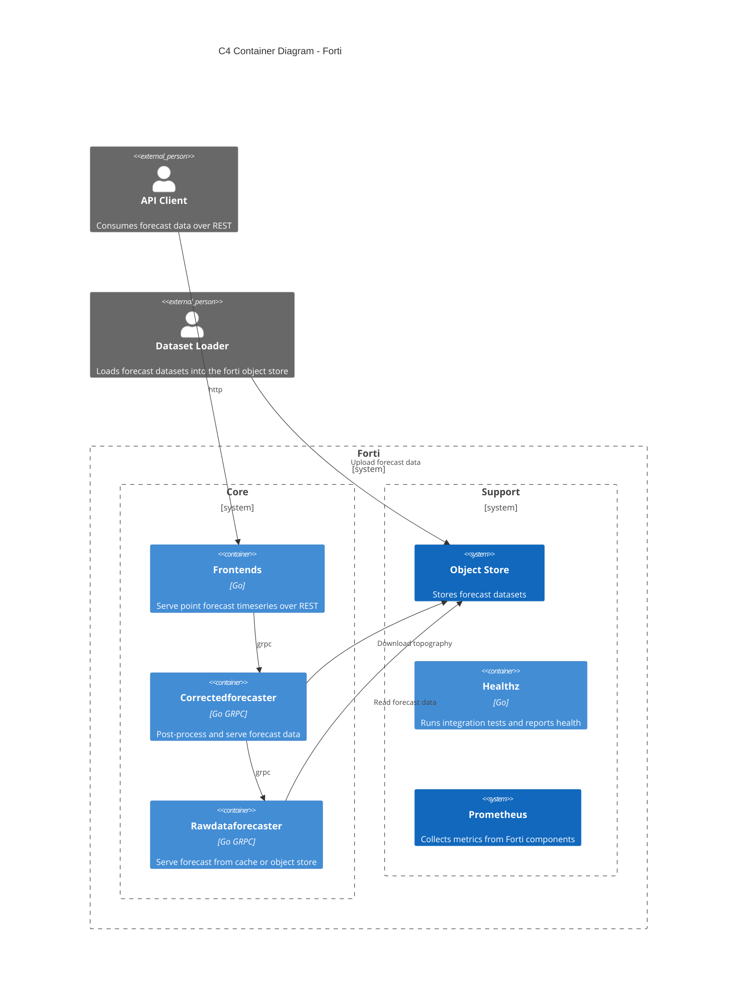

# Forti

## What is it?

Forti is a REST webservice that delivers weather and ocean forecast timeseries data for a specified lat/long coordinate. 

The data sources to the service are irregular grids of data, produced by batch jobs. These batch jobs use a wide range of input datasets, and run a set of post-processing algorithms to both improve the forecast quality and to add additional forecast parameters.

The application is built with Go, although with some small parts in C++. It is meant to be run as containers — each component has an associated Dockerfile.

The code for the batch jobs that produce the datasets are not included in this repository.

## Getting started

[Getting started guide](docs/getting-started.md)

## Development

### Test

## Architecture

The application is made up of several binaries working together.

- jsonfrontend and xmlfrontend: serves the REST interface.
- healthz: monitors the overall health of the application.
- rawdataforecaster: delivers forecast through a GRPC interface, from either a in-memory cache or from a blob storage.
- correctedforecaster: collects data from the grpc interface, does some post-processing on the forecast and delivers the forecast through the same grpc interface.
- Azure blob storage: Object store containing the latest version of all the forecast data.
- Ecflow: Workflow manager specifying how and when to produce the forecast datasets.
- PPI: Compute, job scheduling and storage system for producing the forecast datasets. Storage system contains most of source data needed to produce the datasets.

### C4 container diagram

