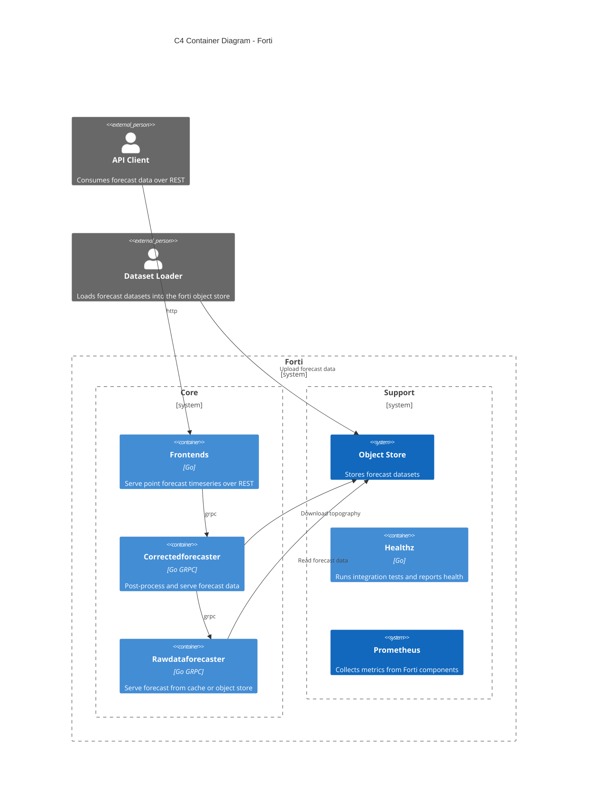

# Forti

## What is it?

Forti is a REST webservice that delivers weather and ocean forecast timeseries data for a specified lat/long coordinate. 

The data sources to the service are irregular grids of data, produced by batch jobs. These batch jobs use a wide range of input datasets, and run a set of post-processing algorithms to both improve the forecast quality and to add additional forecast parameters.

The application is built with Go, although with some small parts in C++. It is meant to be run as containers — each component has an associated Dockerfile.

The code for the batch jobs that produce the datasets are not included in this repository.

## Getting started

[Getting started guide](docs/getting-started.md)

## API Documentation

[API Reference](docs/api-reference.md) – Complete documentation for the JSON REST API

## Architecture

The application is made up of several binaries working together.

- **jsonfrontend**: REST API serving forecasts in JSON format (recommended)
- **xmlfrontend**: Legacy XML REST API (deprecated, do not use for new integrations)
- **moxfrontend**: Legacy MOX variant (deprecated, do not use for new integrations)
- **healthz**: Monitors the overall health of the application
- **rawdataforecaster**: Delivers forecasts through a gRPC interface, reading from cache or blob storage
- **correctedforecaster**: Post-processes forecasts (temperature correction, etc.) and exposes them via gRPC

### C4 container diagram

```mermaid
C4Container
  title C4 Container Diagram - Forti

  Person_Ext(client, "API Client", "Consumes forecast data over REST")
  Person_Ext(dataloader, "Dataset Loader", "Loads forecast datasets into the forti object store")

  Boundary(forti, "Forti") {
    Boundary(core, "Core") {
      Container(frontends, "Frontends", "Go", "Serve point forecast timeseries over REST")
      Container(correctedforecaster, "Correctedforecaster", "Go GRPC", "Post-process and serve forecast data")
      Container(rawdataforecaster, "Rawdataforecaster", "Go GRPC", "Serve forecast from cache or object store")
    }
    Boundary(support, "Support") {
      System(objectstore, "Object Store", "Stores forecast datasets")
      Container(healthz, "Healthz", "Go", "Runs integration tests and reports health")
      System(prometheus, "Prometheus", "Collects metrics from Forti components")
    }
  }

  Rel(client, frontends, "http")
  Rel(frontends, correctedforecaster, "grpc")
  Rel(correctedforecaster, rawdataforecaster, "grpc")

  Rel(dataloader, objectstore, "Upload forecast data")
  Rel(correctedforecaster, objectstore, "Download topography")
  Rel(rawdataforecaster, objectstore, "Read forecast data")
```
