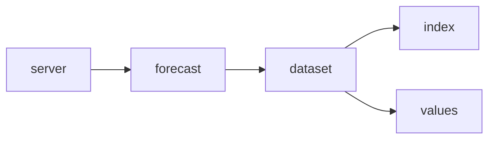

# Simple Forecaster

Serves unmodified data from a forecast. The term 'simple' refers to the data not having been processed by forti.

## Serving data

Four components are mainly involved in serving data: 

### server

Handles incoming grpc requests, including protobuf serialization.

### forecast

Determines what is the correct group (and version) to serve data from. Forwards requests to the relevant `dataset` handler.

### dataset

Each object of type `dataset.Dataset` serves data for a single area/version. They maintain a list of grids for its area. A grid is a unique collection of latitude/longitude pairs within a single area. They exist because different parameters may have different grid resolutions.

Handles requests for a given latitute/longitude pair. For each grid, lookup the correct index from `index`, and find relevant data from `values`.

### index

Handles lookup from latitude/longitude to a grid index.

### values

A collection of all data having the same area and grid id. 

Provides a `Reader` interface, for looking up data with a given index. The index is provided by the `geo` component. There are several implementations of this interface.

## Loading data

`forecast` component contains a function, `Forecast.update`, that is called periodically in a goroutine. It checks a blob store for updates, and loads data if needed, by calling `dataset.Download`.

## Other modules

### internal.health

Provides grpc healthcheck, meant for kubernetes readiness probe.

### pointdata

Defines internal data format. Its placement reflects that several modules in various places in the hierarchy needs access to this.
